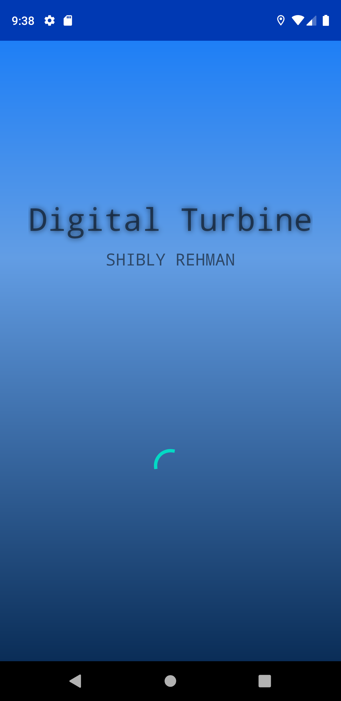
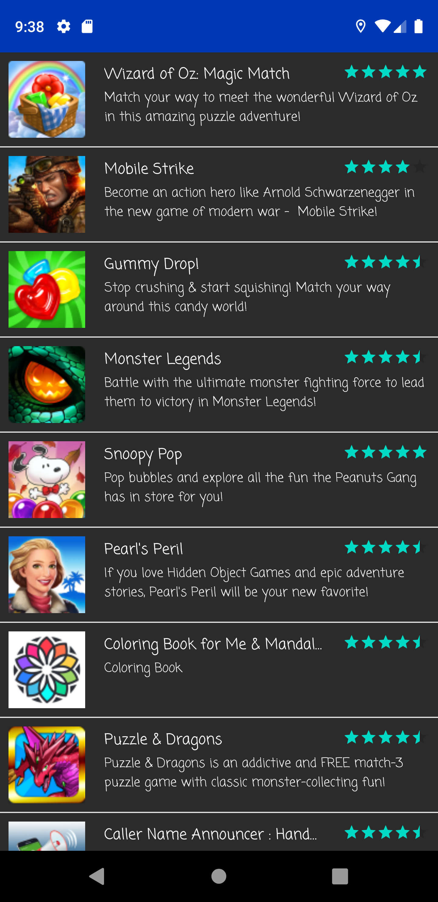

# Digital Turbine Assessment

## Instructions

Create an Android app that consists of two screens. The first screen contains a scrolling list of products, which uses the following URL as the datasource. In this screen, each item should display at least name, thumbnail, rating of the product. When the user clicks on one of the items, it brings the user to the second screen. The second screen should contain all information provided by the aforementioned datasource. Clicking the back button should bring the user back to the first screen.

http://ads.appia.com/getAds?id=236&password=OVUJ1DJN&siteId=10777&deviceId=4230&sessionId=techtestsession&totalCampaignsRequested=10

For every request to the URL above, add a parameter called “lname” and insert your last name as the value.

Use of 3rd party libraries is allowed. Please consider unit testing and other code quality concerns as necessary.

Please submit completed work to a github repository and provide the link to your DT contact.

## APK
[APK](apk/app-debug.apk)

## Screens

                    Splash                  |                  Main                   |                Details
 |  | 

